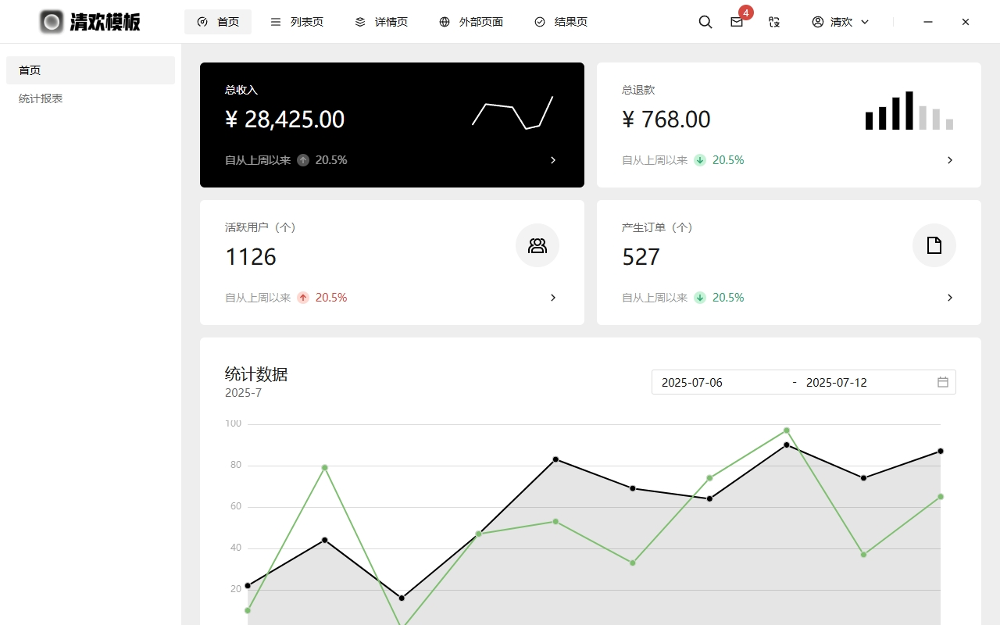
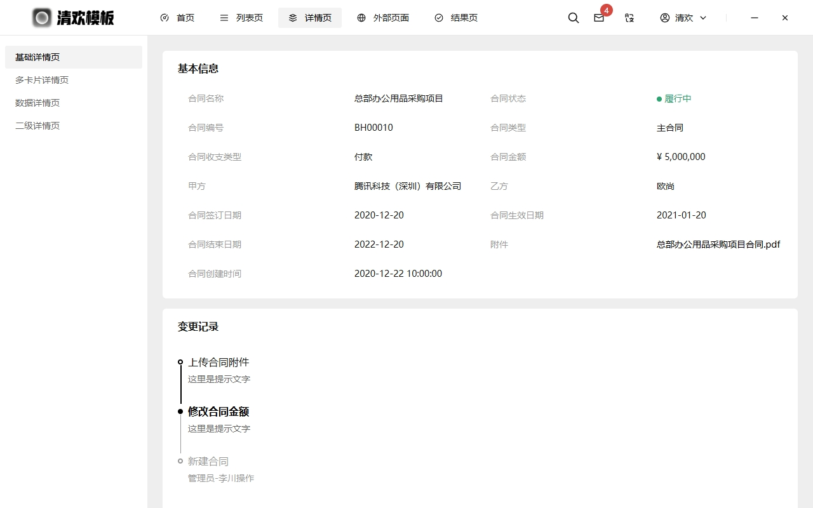

<h1 align="center">Wails-Template</h1>

<p align="center" style="text-align: center">
  <br/>
</p>
  使用 Go 和 Web 技术构建桌面应用程序。
  <br/>
  <br/>
  <a href="https://github.com/lmb1113/wails-template/blob/master/LICENSE">
    
  </a>
</p>


## 项目介绍

Wails模板 桌面应用项目模板，使用wails+vue3+tdesign+golang 开箱即用

## 功能

- 后端使用标准 Go
- 使用优秀的前端框架[Tdesign](https://github.com/Tencent/tdesign-vue-next)
- 使用Vue3
- 从 Javascript 轻松调用 Go 方法
- 无边框应用
- 其他功能与[WailsApp](https://github.com/wailsapp/wails)保持一致
## 预览






## 路线图
- [ ] 编写使用文档-开箱即用
- [ ] 实现相关go和js交互的示例
- [ ] 实现登录注册等简单后端模块
- [ ] 优化工程目录文件

## 快速入门

### 项目开发
```
#克隆项目
git clone git@github.com:lmb1113/wails-template.git


# 进入项目
cd wails-template

#安装wails-cli（如果已安装请跳过）
go install github.com/wailsapp/wails/v2/cmd/wails@latest

#前端下载依赖
cd frontend
pnpm install


#项目启动
在wails-template根目录执行
wails dev

#项目编译打包(如需其他参数参考wails文档)
wails build

## 前端单独调试运行（仅单独调试前端页面时需执行，使用wails启动无需执行，wails会自动执行）
pnpm dev
```

### 其他
前端框架文档参考 [tdesign官网](https://tdesign.tencent.com/vue-next/overview)。

底层跨平台文档参考 [wails官网](https://wails.io/zh-Hans/docs/gettingstarted/installation/)。

## 常见问题

- 它是什么东西?
  这是一个使用go+vue3进行跨平台的项目模板，融合wails和tdesign，目标是开箱即用
- 这个项目针对的是哪些人?
  想使用go+vue开发桌面应用的开发者

## 灵感

本项目站在在巨人的肩膀上，项目灵感主要来自以下项目：

- [WailsApp](https://github.com/wailsapp/wails)
- [Tdesign](https://github.com/Tencent/tdesign-vue-next)
